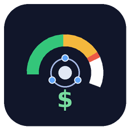

# OpenRouter Credit Monitor

<p align="center">
  
</p>

<p align="center">
  <a href="https://github.com/jphermans/openrouter-credit-monitor">
    
  </a>
  <a href="https://agent-zero.ai">
    
  </a>
  
</p>

---

## Overview

**OpenRouter Credit Monitor** is an Agent Zero plugin that displays your OpenRouter account credits directly in the Agent Zero WebUI sidebar. Never be surprised by depleted credits again — monitor your balance at a glance and receive notifications when credits run low.

## Features

- 📊 **Real-time Balance Display** — Shows remaining OpenRouter credits in the sidebar
- 🔔 **Low-Credit Alerts** — Configurable warnings at $5.00 (low) and $1.00 (critical)
- 🔑 **API Key Usage** — Optional display of per-key usage and limits
- ⚡ **Auto-Refresh** — Configurable refresh interval (30s to 10 minutes)
- 🎨 **Clean UI** — Non-intrusive indicator that blends with Agent Zero's design
- 🔒 **Secure** — Credentials never leave your server; all API calls are server-side

## Installation

### Prerequisites

- Agent Zero v2.13 or higher
- OpenRouter account with a **Management Key** (required)
- Optional: OpenRouter API Key for per-key usage tracking

### Getting Your OpenRouter Credentials

1. **Management Key** (required):
   - Go to [openrouter.ai/settings/keys](https://openrouter.ai/settings/keys)
   - Create a new **Provisioning API key**
   - Copy the key — it will only be shown once

2. **API Key** (optional):
   - Your normal OpenRouter API key (`sk-or-...`)
   - Used for per-key usage information

### Install the Plugin

1. Clone this repository into your Agent Zero plugins directory:
   ```bash
   cd /a0/usr/plugins
   git clone https://github.com/jphermans/openrouter-credit-monitor.git
   ```

2. Restart Agent Zero or enable the plugin via Settings → Plugins

3. Configure the plugin:
   - Go to **Settings → Plugins → OpenRouter Credit Monitor**
   - Enter your **Management Key**
   - (Optional) Enter your **API Key**
   - Adjust refresh interval and warning thresholds
   - Click **Save**

## Configuration

| Setting | Type | Default | Description |
|---------|------|---------|-------------|
| `openrouter_management_key` | Secret | — | Your OpenRouter Management Key (required) |
| `openrouter_api_key` | Secret | — | Your OpenRouter API Key (optional) |
| `refresh_interval_seconds` | Integer | 60 | How often to refresh (30–600 seconds) |
| `low_credit_warning` | Float | 5.00 | Balance threshold for "Low" warning (USD) |
| `critical_credit_warning` | Float | 1.00 | Balance threshold for "Critical" alert (USD) |
| `show_balance_in_ui` | Boolean | true | Show the balance indicator in sidebar |

## Usage

### Viewing Your Balance

The credit indicator appears at the **top of the sidebar** in Agent Zero. It shows:
- Provider name ("OpenRouter")
- Current balance (e.g., "$44.58")
- Status badge ("Low" or "Critical" when thresholds exceeded)

### Opening the Popover

Click the indicator to see:
- **Remaining** — Current available credits
- **State** — OK / Low / Critical
- **Updated** — Last refresh timestamp
- **Refresh** — Manually refresh balance
- **Settings** — Open plugin settings

### Receiving Alerts

When your balance falls below configured thresholds:
- **Low** (≤ $5.00): Status shows "Low" in orange
- **Critical** (≤ $1.00): Status shows "Critical" in red + system notification

Notifications are sent only on threshold transitions (not on every refresh).

## Security

- ✅ Credentials are stored securely via Agent Zero's secrets system
- ✅ API keys are never exposed to the browser or client-side JavaScript
- ✅ All OpenRouter API calls happen server-side
- ✅ No credentials are logged or included in error responses

## Architecture

```
┌─────────────────────────────────────────────────────────┐
│                   Agent Zero WebUI                       │
│  ┌─────────────────────────────────────────────────┐  │
│  │  credit-indicator.html (sidebar-top)             │  │
│  │  └── credit-monitor-store.js (Alpine store)    │  │
│  └─────────────────────────────────────────────────┘  │
└─────────────────────────────────────────────────────────┘
                         │
                         ▼
┌─────────────────────────────────────────────────────────┐
│           /api/plugins/openrouter_credit_monitor/status  │
└─────────────────────────────────────────────────────────┘
                         │
                         ▼
┌─────────────────────────────────────────────────────────┐
│  helpers/openrouter_client.py                           │
│  └── GET openrouter.ai/api/v1/credits (Management Key)  │
│  └── GET openrouter.ai/api/v1/key (API Key)            │
└─────────────────────────────────────────────────────────┘
```

## Troubleshooting

### "Setup Required" Status

- Verify your **Management Key** is correctly configured
- Check that the key has not expired

### "Unavailable" Status

- Check your internet connection
- Verify OpenRouter API is accessible
- Check Agent Zero logs for errors

### Balance Not Updating

- Ensure refresh interval is not too short (minimum 30 seconds)
- Try manual refresh via the popover
- Check for OpenRouter API rate limits

## Uninstalling

1. Go to **Settings → Plugins**
2. Find **OpenRouter Credit Monitor**
3. Toggle it **off** or delete the plugin folder
4. Restart Agent Zero

## License

MIT License — see [LICENSE](LICENSE) for details.

## Support

- 🐛 **Issues**: [Report bugs](https://github.com/jphermans/openrouter-credit-monitor/issues)
- 💬 **Discussions**: [Ask questions](https://github.com/jphermans/openrouter-credit-monitor/discussions)
- 📖 **Agent Zero Docs**: [agentzero.ai/docs](https://agentzero.ai/docs)

---

<p align="center">
  <em>Built for Agent Zero — The autonomous AI assistant framework</em>
</p>
